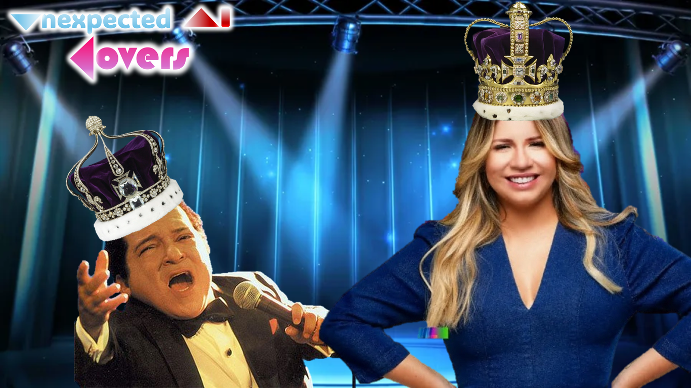
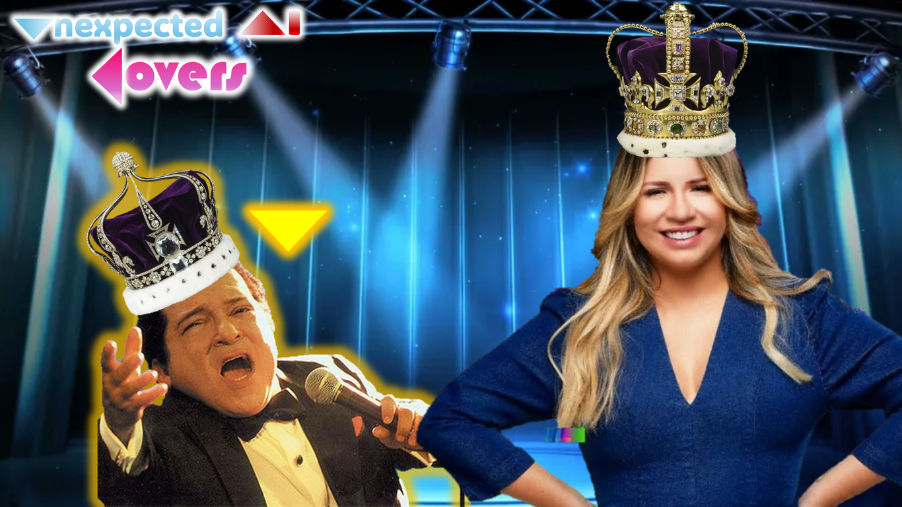
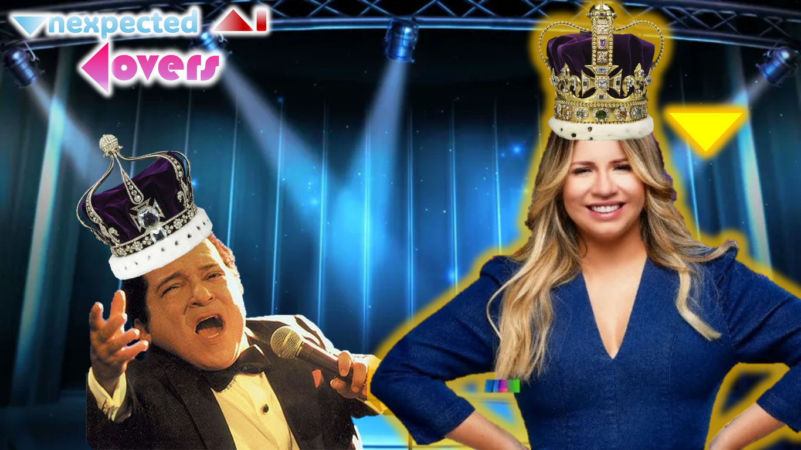

# music-currentsinger-switcher

Useful for music AI covers, to show which singer is currently performing (for example, when you put AI to duet with the original singer).

Need the help of a video capture software like OBS Studio.

Also, remember to place your music in this project's folder, renaming it to `music.mp3`; then pay attention closely listening to the audio points (in seconds, or seconds+miliseconds, or minutes+seconds/minutos+seconds+miliseconds) and annotate them (and their respective singer) modifying the timeline in `main.js`.

## Screenshots:

<table>
<tbody>
<tr>
<td> No singer singing</td>
<td> Singer 1 singing!</td>
<td> Singer 2 singing!</td>
<td> Both singers singing!</td>
</tr>
<tr>
<td> No singer singing</td>
<td> Singer 1 singing!</td>
<td> Singer 2 singing!</td>
<td> Both singers singing!</td>
</tr>
</tbody>
</table>
<!-- DivTable.com -->

## Live example:

The first video that used this tool:

